### 📓 Journal de Bord - Projet TaskFlow (Océane GLANEUX & Athénaïs GRAVIL)

## 🏗️ Architecture Globale

- Base de données & Auth : Supabase (PostgreSQL)
- Logique Métier : Azure Functions (Node.js)
- Stockage Fichiers : Uploadthing
- Communications : Resend (Emails transactionnels)

# 📍 Phase 1 : Setup & Modélisation

**Objectif** : Mise en place de l'infrastructure de données et insertion des premières données de test.

- **Choix techniques** : Utilisation de l'extension `auth.users` de Supabase. Lors de la création des tables, nous avons validé l'activation automatique du **Row Level Security (RLS)** via la fenêtre de confirmation de l'éditeur SQL de Supabase pour garantir la sécurité dès l'initialisation.
- Lien Supabase : https://bmzgkoxyjezovtuhyuwv.supabase.co

- Ce que nous avons fait :

1. Création du projet sur Supabase.
2. Exécution du script de création des 6 tables.
3. **Action spécifique** : Lors de l'exécution du SQL, nous avons cliqué sur "Run and enable RLS" suite à l'alerte de sécurité de Supabase pour protéger la table tasks.
4. Insertion des profils et des tâches de test.

- **Code clé (Correction Bug UUID) :**

```
-- Correction du type pour l'insertion (Cast explicite en ::uuid)
INSERT INTO profiles (id, username, full_name) VALUES
 ('USER-1'::uuid, 'alice', 'Alice Martin'),
 ('USER-2'::uuid, 'bob', 'Bob Dupont');
INSERT INTO projects (id, name, description, owner_id) VALUES
 (gen_random_uuid(), 'Refonte API', 'Migration vers serverless', 'USER-1'::uuid);
WITH proj AS (SELECT id FROM projects WHERE name = 'Refonte API' LIMIT 1)
INSERT INTO tasks (project_id, title, status, priority, assigned_to, created_by)
SELECT proj.id, 'Configurer Supabase', 'done', 'high', 'USER-1'::uuid,
'USER-1'::uuid FROM proj UNION ALL
SELECT proj.id, 'Implémenter RLS', 'in_progress', 'high', 'USER-1'::uuid,
'USER-1'::uuid FROM proj UNION ALL
SELECT proj.id, 'Connecter Azure', 'todo', 'medium', 'USER-2'::uuid,
'USER-1'::uuid FROM proj;
```

- **Blocage & Résolution :**
  - **Erreur** : Échec de l'insertion des données de test à cause d'un format de chaîne non reconnu comme UUID pour les clés étrangères.

  - **Résolution** : Nous avons récupéré les UUID réels dans l'onglet Authentication > Users et appliqué un cast explicite ::uuid dans le script SQL pour forcer la correspondance des types entre les tables.

* Validation — Phase 1

- Les 6 tables existent dans Table Editor

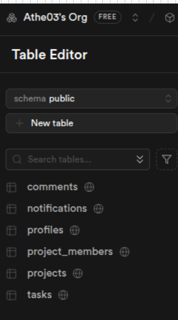

- Le trigger updated_at fonctionne (UPDATE tasks SET title='test' WHERE id=... →
  updated_at change)

```
SELECT id, title, updated_at, created_at from tasks;
```

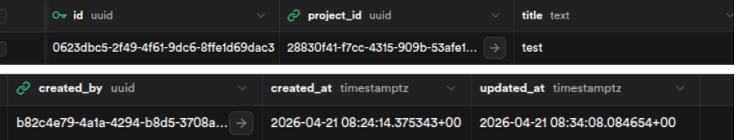

- 2 profils et au moins 3 tâches insérés

```SELECT 'profiles' as "table", count(*) from profiles
UNION ALL
SELECT 'tasks', count(*) from tasks;
```

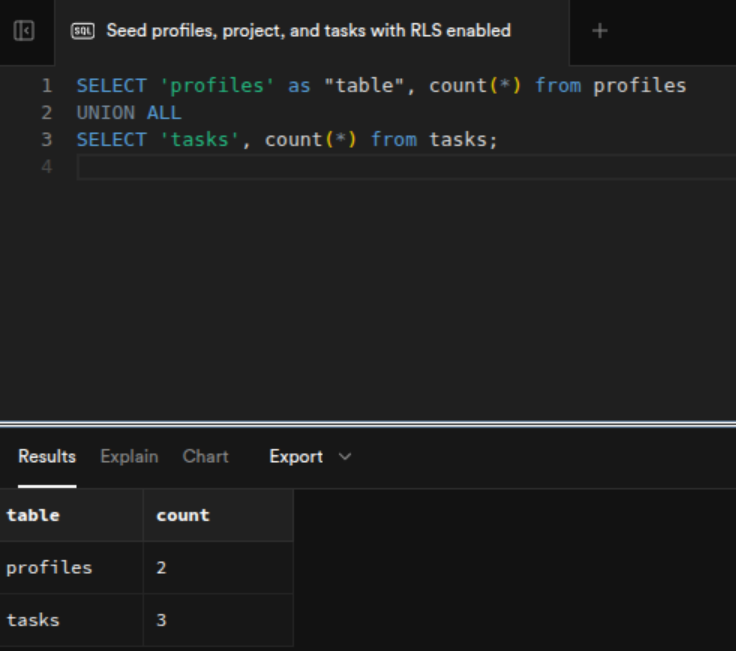

- Le binôme peut accéder au projet

`OUI`

## 🔐 Phase 2 : Authentification & Row Level Security

**Objectif** : Sécuriser l'accès aux données en fonction de l'utilisateur connecté.

- **Problèmes rencontrés & Résolutions** :
  - **URL Supabase** : L'URL dans le fichier `.env` contenait `/rest/v1/`, ce qui provoquait des erreurs de connexion. Nous l'avons corrigée en `https://secret.supabase.co`.
  - **Support ES Modules** : Erreur lors de l'exécution des scripts avec `import`. Nous avons ajouté `"type": "module"` dans le `package.json`.
  - **Scripts NPM** : Mise à jour du script de test : `"test": "node test-rls.js"`.
  - **Génération UUID Projet** : Nous avons ajouté une génération aléatoire pour l'UUID du projet (`gen_random_uuid()`) car celui-ci n'était pas retrouvé correctement lors des insertions liées s'il n'était pas généré explicitement au préalable.
  - **Boucle Infinie RLS** : Une erreur de récursion infinie est survenue sur la table `project_members`. Nous avons résolu le problème en désactivant temporairement le RLS pour cette table spécifique
    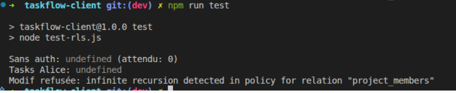
    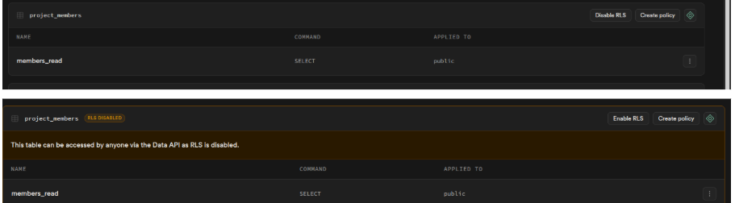

* Validation — Phase 2

- Exécution de `npm test` :
  - Sans authentification : 0 tâches visibles.
  - Alice authentifiée : Accès à ses tâches (✅).
  - Tentative de modification sur une tâche de Bob : Refusée (RLS silencieux ou erreur).

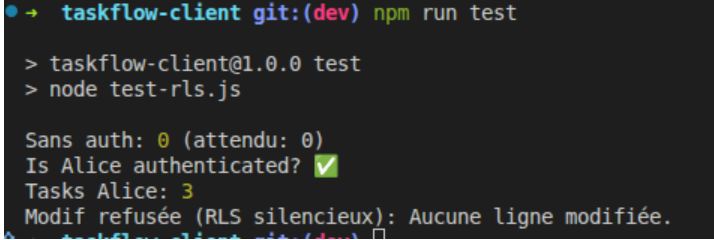

## ⚡ Phase 3 : Temps Réel (Realtime)

**Objectif** : Synchronisation instantanée entre les membres d'un projet.

- **Mise en œuvre** : Activation de `supabase_realtime` pour les tables `tasks` et `comments`.
- **Problème rencontré** : Initialement, au moment de la création via les scripts de test, les tâches n'étaient assignées à personne, ce qui empêchait de vérifier correctement les flux de travail.
- **Résolution** : Mise à jour de `bob-actions.js` pour inclure l'assignation automatique dès la création.
- **Validation** :
  - Lancement de `node alice-watch.js` pour écouter les changements.
  - Lancement de `node bob-actions.js` pour effectuer des modifications.
  - Alice reçoit instantanément les notifications de création, modification et ajout de commentaires.

**Focus Bob Actions** :
Mise à jour de `bob-actions.js` pour inclure l'assignation automatique des tâches créées :

```javascript
const task = await createTask(PROJECT_ID, {
  title: "Implémenter le Realtime",
  priority: "high",
  assignedTo: BOB_ID, // Attribution explicite à Bob pour corriger l'absence d'assignation
});
```

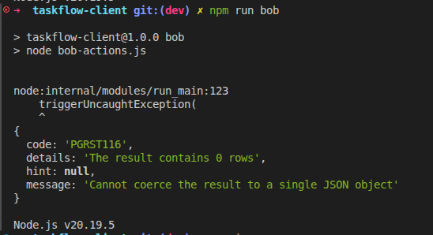

- Validation — Phase 3

* [x] getProjectTasks() retourne les tâches avec profils et comptage de commentaires
* [x] Compte Uploadthing créé, clés dans .env
* [x] La colonne file_url existe dans la table tasks
* [x] Alice reçoit en temps réel les créations de Bob (< 500ms)
* [x] Les changements de statut arrivent instantanément
* [x] La présence affiche les 2 utilisateurs simultanément

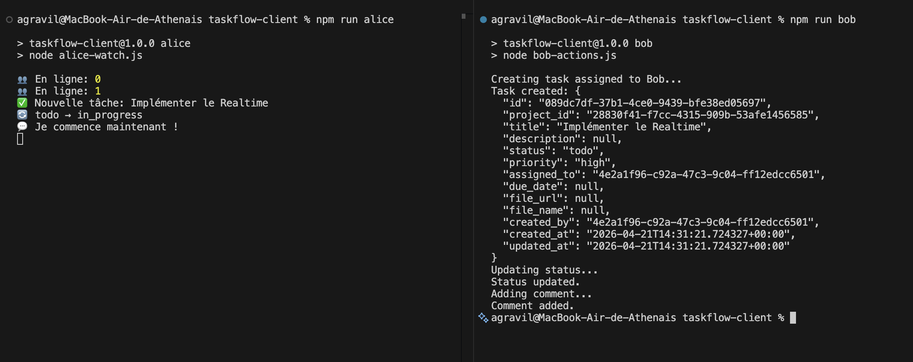

# ☁️ Phase 4 : Azure Functions — Notifications par email

**Objectif** : Automatiser l'envoi d'emails lors de l'assignation d'une tâche via une architecture serverless.

- **Problèmes rencontrés & Résolutions** :
  - **Région Azure** : La région `westeurope` ne fonctionnait pas pour le déploiement. Nous avons utilisé `spaincentral` à la place.
    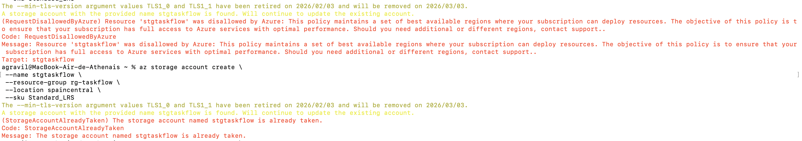

  - **Nom du Stockage** : Le nom de compte de stockage `stgtaskflow` était déjà utilisé globalement. Nous avons opté pour `stgtaskflow1`.

  - **Programmation v4 & Modules** : Suite à des problèmes de compatibilité des modules (ES Modules) qui ne fonctionnaient pas en v3, nous avons migré vers le modèle de programmation **Azure Functions v4**. Ce changement a permis de stabiliser le déploiement de nos fonctions via l'approche "App".

* Validation — Phase 4

- [x] Compte Resend créé, clé API dans `.env` et dans les settings Azure
- [x] Function App `fn-taskflow` déployé (visible dans le portail Azure)
- [x] Webhook Supabase configuré sur `UPDATE` de tasks
- [x] Assignation d'une tâche → notification insérée dans la table `notifications`
      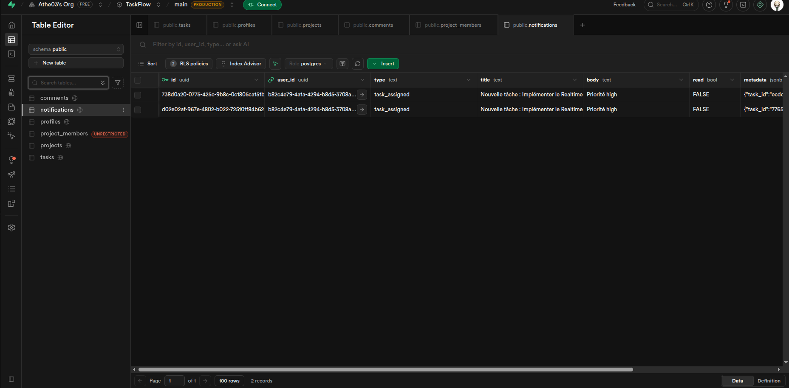
- [x] Logs visibles : `az functionapp logs tail --name fn-taskflow --resource-group rgtaskflow`
      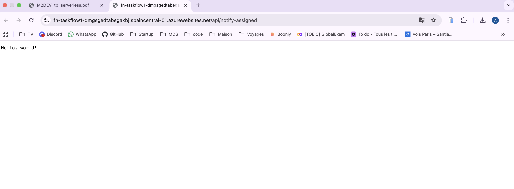

- **Déploiement final** : Les 4 fonctions sont désormais opérationnelles et visibles sur Azure.
  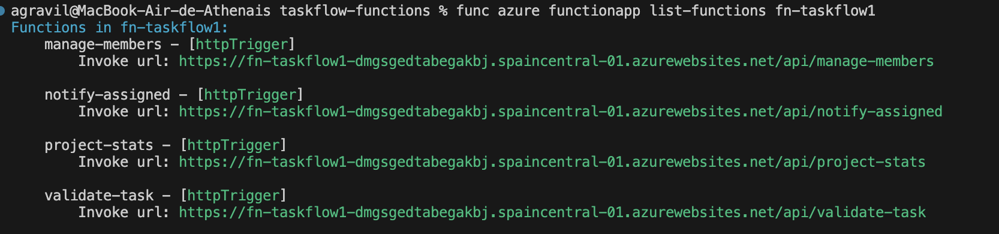
  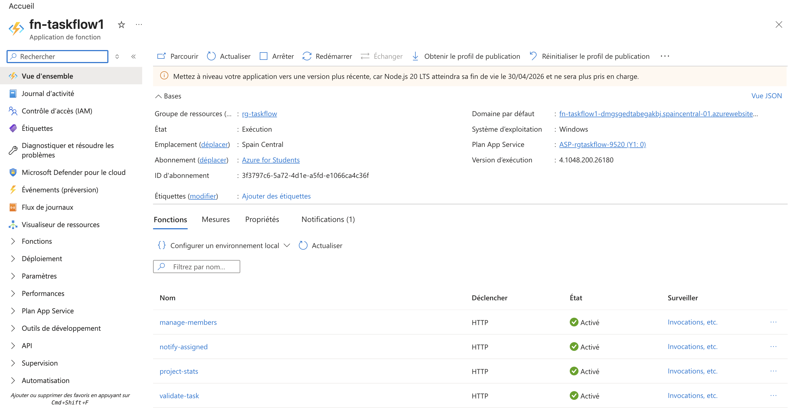

## 🚀 Phase 5 : Finalisation & Tests Avancés

**Objectif** : Valider l'ensemble de la logique métier serverless et la sécurité des endpoints.

- **Problèmes rencontrés & Résolutions** :
  - **Exposition des URLs** : Lors du premier déploiement, les URLs n'étaient pas correctement exposées. Une fois le problème de configuration réglé, les endpoints sont devenus accessibles.
  - **Manage Members** : Le test de retrait échouait car le projet utilisé pour le test n'avait pas de "owner" défini. Nous avons corrigé cela en passant l'utilisateur en tant que `owner` pour valider les règles de gestion (un owner ne peut pas se retirer lui-même et un simple membre ne peut pas gérer les membres).

* Validation — Phase 5

- [x] **4 fonctions déployées** : Visibles et actives dans le portail Azure.
- [x] **`validate-task`** : Rejette correctement les titres trop courts, les dates passées et les assignations à des non-membres.
      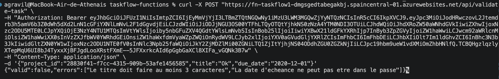
- [x] **`project-stats`** : Retourne des données cohérentes (taux de complétion, tâches par statut, membres actifs).
      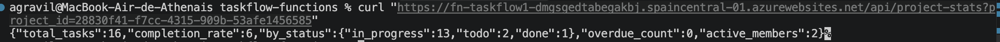
- [x] **`manage-members`** :
  - Un simple membre reçoit une `403 Forbidden`.
  - Le `owner` ne peut pas être retiré du projet (sécurité logicielle).
    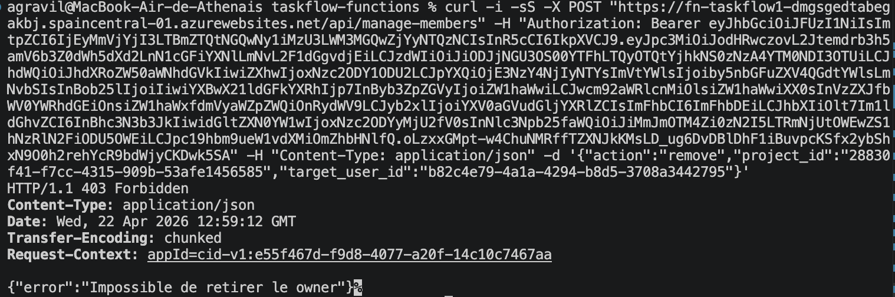

# 🏁 Phase 6 : Validation Finale — Intégration bout-en-bout

**Objectif** : Vérifier que tous les composants (Auth, RLS, Realtime, Azure Functions) collaborent sans friction.

- **Problèmes rencontrés & Résolutions** :
  - **Correction URL Stats** : Une erreur de frappe dans le script d'intégration utilisait `projectstats` au lieu de `project-stats`. La correction de l'URL vers l'endpoint Azure a permis de récupérer les métriques finales.
  - **Déclenchement Notifications** : Le Webhook Supabase ne se déclenchait que lors d'un changement effectif de la valeur de la colonne `assigned_to`. Pour valider le flux complet, nous avons dû mofidier les scripts de test pour qu'ils effectuent une mise à jour réelle de l'assignation (et non une simple ré-écriture de la même valeur).

* Validation — Phase 6

- [x] **Script d'intégration** : Le script `integration.js` s'exécute sans erreur du début à la fin.
- [x] **Complétion** : Atteint les 100% après la mise à jour de toutes les tâches via le script.
- [x] **Événements Realtime** : Alice reçoit exactement les 6 événements attendus (2 vagues de 3 tâches).
- [x] **Notifications** : La table `notifications` contient bien les logs d'assignation pour Bob.
- [x] **Performance Azure** : Les fonctions répondent en moins de 500ms, assurant une synchronisation fluide.

---
*Projet réalisé dans un cadre pédagogique (TP Master 2 — Serverless).*
